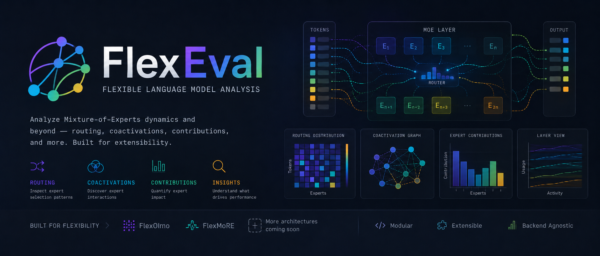

<p align="center">
  
</p>

<p align="center">
  
  
  
  
  
</p>

<p align="center">
  
</p>

# FlexEval

FlexEval is a unified evaluation and analysis project for Flex-family models.
It brings Flex capture and analysis together with integrated `EuroEval` and
`olmes` support in one repository and one shared installation flow.

## Requirements

- Python `3.11`
- PyTorch `2.8.0`
- Datasets `3.6.0`
- Accelerate `1.13.0`
- Transformers fork `peter-sk/transformers@9da5df2d2d2fe155f861d6248ba5bb0b1c769513`

## Installation

### From source

```bash
git clone https://github.com/AnnemetteBP/FlexEval.git
cd FlexEval
```

### Conda setup

Use one shared Conda environment and install the project with `pip`.

#### Development setup

```bash
BACKEND=euroeval ENGINE=transformers bash env/setup_dev_env.sh
BACKEND=olmes ENGINE=transformers bash env/setup_dev_env.sh
BACKEND=all ENGINE=transformers bash env/setup_dev_env.sh
BACKEND=all ENGINE=vllm bash env/setup_dev_env.sh
```

#### Runtime setup

```bash
BACKEND=euroeval ENGINE=transformers bash env/setup_runtime_env.sh
BACKEND=olmes ENGINE=transformers bash env/setup_runtime_env.sh
BACKEND=all ENGINE=transformers bash env/setup_runtime_env.sh
BACKEND=all ENGINE=vllm bash env/setup_runtime_env.sh
```

Supported setup variables:

- `BACKEND=none|euroeval|olmes|all`
- `ENGINE=transformers|vllm`
- `ENV_NAME=<name>`
- `PYTHON_VERSION=3.11`
- `USE_CONDA=auto|yes|no`

### Manual installation

If you already have a Python or Conda environment, install the root project
first and then add the backend you want.

#### Root package

```bash
pip install -e .
pip install -e ".[dev]"
pip install -e ".[vllm]"
pip install -e ".[dev,vllm]"
```

#### EuroEval support

```bash
pip install -r env/requirements-backend-euroeval.txt
pip install --no-deps -e ./EuroEval
```

#### olmes support

```bash
pip install -r env/requirements-backend-olmes.txt
pip install --no-deps -e ./olmes
```

## What FlexEval Provides

- One root project install in [`pyproject.toml`](./pyproject.toml)
- Flex-family capture and analysis code under `src/flex_eval/src/flexolmo_analysis/`
- Unified CLI entry points under `src/flex_eval/src/flexeval/`
- Optional backend support for `EuroEval` and `olmes`
- Optional `vllm` runtime support
- Shared setup wrappers in `env/`

## Verification

```bash
python -c "import flexeval; print('ok')"
python -m flexeval.cli.run --help
python -c "from transformers import FlexOlmoForCausalLM; print(FlexOlmoForCausalLM)"
```

## Usage

Run the unified CLI with the selected backend, dataset, model, and engine.

```bash
python -m flexeval.cli.run \
  --backend euroeval \
  --dataset <dataset_name> \
  --model <model_name_or_path> \
  --engine transformers
```

## Repository Layout

- `src/flex_eval/src/flexeval/` contains the unified root package
- `src/flex_eval/src/flexolmo_analysis/` contains Flex capture and analysis code
- `env/` contains setup wrappers and optional backend or engine requirement files
- `EuroEval/` contains the integrated EuroEval source tree
- `olmes/` contains the integrated olmes source tree
- `OLMo-core/` and `Megatron-LM/` are vendored components used by the project
